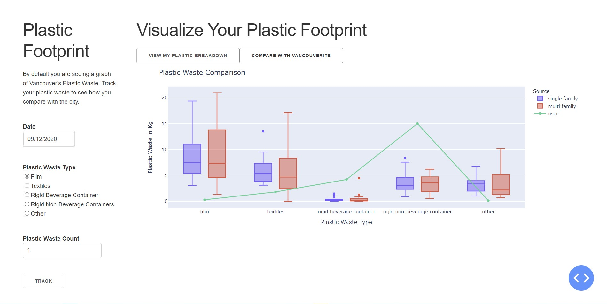

# Foot Print App: Reducing Personal Plastic Waste Footprint

## Project description
(adapted from project descriptions provided by organizers)

Plastic pollution is one of the most pressing threats to our global oceans. From providing us with half of the oxygen we breathe and stabilizing our climate, to feeding over one billion people worldwide, the oceans are vital to our everyday wellbeing. 

However, each year an unprecedented amount of plastic litter- an average of 8 mln tonnes - make their way to the marine realm, having devastating consequences for wildlife and compromising our ecosystem's health. Because 80% of plastic litter is estimated to originate from land, we can all take action towards a healthier future for our environment and ourselves by tackling our individual plastic footprint.

A 2018 study found that 1.1 billion of single-use items including bags and cups filled Metro Vancouver landfills - equivalent of 400 items per resident (source: TRI Environmental Consulting).

Our goal is to create an application that helps users to track and reduce their plastic footprint. The final app should allow the user to compare their plastic waste habits to the average Vancouverite or the average Canadian or North American.

For our data sources we have:
- Metro Vancouver Study 2018 Vancouver Transfer Station - Combined Waste Sort Results.
- We can also supplement these data sources with any suggestions we come up with as a team.

## Team members
- [Katelyn Boughton (Hacker)](https://www.linkedin.com/in/katelyn-boughton/)
- [Seung Yun Kim (Mentor)](https://www.linkedin.com/in/seungyun-kim/)
- [Amanda Leslie (Hacker)](https://www.linkedin.com/in/amanda-l-9186433a/)
- [Ore Ogundipe (Team Lead)](https://oreogundipe.dev/whoami)
- [Lien Quach (Hacker)](https://www.linkedin.com/in/lienq/)
- [Rosalyn Williams (Hacker)](https://github.com/paxcodes)

## Datajam Schedule
| Time | Description |
| --- | --- |
| 8:30am | Opening Ceremony |
| 9:30am | Official hack start time! Meet together as team and get to know each other|
| 9:45am | Project brainstorming & defining tasks |
| 10:00am | Optional Git workshop*|
| 10:30am | Hack & work on tasks |
| 12:30pm | Check-in #1: meet back up as a team |
| 1:00pm | Hack & work on tasks |
| 3:30pm | Check-in #2: meet back up as a team |
| | Debugging, prioritizing remaining tasks |
| 5:00pm | Final repository merging |
| | Prepare demo or slides |
| 6:30pm | Project deadline & final Presentation! |
| 7:30pm | Career Panel & Q&A |
| 8:30pm | Awards Ceremony & Closing |

*For those who need help with Git! For those who don't, we can stay on call and continue brainstorming.

## How to use code in this repository

- Install project requirements
`pip install -r requirements.txt`

- Run Application
`python app.py`

## References

1. [Metro Vancouver Study 2018 Vancouver Transfer Station - Single-Use Items Waste Composition Study](http://www.metrovancouver.org/services/solid-waste/SolidWastePublications/2018Single-UseItemsWasteCompositionStudy.pdf)
2. [Plotly Dash](https://plotly.com/dash/) - Framework for building ML & data science web apps.
3. [Pandas](https://pandas.pydata.org/) -  Open source data analysis and manipulation tool, built on top of the Python programming language.
